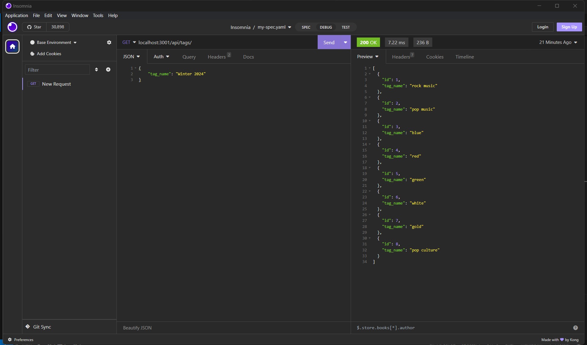

# E-Commerce-Back-End

  ## Description
  This application allows the user to view, add, update, and delete contents of an e-commerce database via RESTful CRUD operations.

  - WHEN the user runs a GET method on a route
  - THEN the user can view the associated array of contents

  - WHEN the user runs a POST method on any of the routes and provides JSON data
  - THEN corresponding objects can be created

  - WHEN the user runs a PUT method on any of the routes and provides JSON data
  - THEN corresponding objects can be updated

  - WHEN the user runs a DELETE method on any of the routes
  - THEN corresponding objects can be deleted

  ## Table of Contents
  - [Installation](#installation)
  - [Usage](#usage)
  - [Contributing](#contributing)
  - [Questions](#questions)
  - [Link](#link-to-site)

  ## Installation
  Via mysql2, sequelize and dotenv

  ## Usage
  n/a

  ## Contributing
  Contribution unavailable at this time

  ## Questions
  Please email questions to joseph.s.foster@icloud.com.
  For additional works, please visit [https://github.com/joseph-s-foster]

  ## Link to Video
  https://drive.google.com/file/d/1e73C8ceJET9clXrgjlPCaZFcg9FCSdaW/view

  ## Screenshot of Application
  
